# Database Schema Documentation

## Entity Relationship Diagram

```mermaid
erDiagram
  User ||--o| Farmer : "has"
  User ||--o| Veterinarian : "has"
  User ||--o| GovernmentOfficial : "has"
  User ||--o| Researcher : "has"
  
  Farmer ||--o{ Livestock : "owns"
  Farmer ||--o{ Prescription : "receives"
  Farmer ||--o{ Alert : "receives"
  Farmer ||--o{ ConsultationRequest : "creates"
  
  Veterinarian ||--o{ Prescription : "issues"
  Veterinarian ||--o{ Farmer : "primary_vet_for"
  Veterinarian ||--o{ ConsultationRequest : "handles"
  
  Livestock ||--o{ AntimicrobialRecord : "has"
  Livestock ||--o{ HealthRecord : "has"
  Livestock ||--o{ TraceabilityLog : "tracks"
  Livestock ||--o{ Prescription : "receives"
  Livestock ||--o{ Alert : "triggers"
  Livestock ||--o| Livestock : "parent_of"
  
  Prescription ||--o{ AntimicrobialRecord : "contains"
  
  Researcher ||--o{ DataRequest : "submits"
  
  GovernmentOfficial ||--o{ InspectionLog : "conducts"
  
  User {
    int id PK
    string firebase_uid UK
    string email UK
    string name
    enum role
    string profile_image_url
    string aadhaar_encrypted
    string phone
    boolean is_active
    boolean is_profile_complete
    int onboarding_step
    datetime created_at
    datetime updated_at
  }
  
  Farmer {
    int id PK
    int user_id FK
    string farm_name
    text farm_address
    string region
    string state
    string district
    string pincode
    float latitude
    float longitude
    string registration_number UK
    float farm_size_acres
    enum farm_type
    int primary_veterinarian_id FK
    datetime created_at
    datetime updated_at
  }
  
  Veterinarian {
    int id PK
    int user_id FK
    string license_number UK
    string specialization
    string qualification
    string alma_mater
    int years_of_experience
    int age
    string clinic_hospital_name
    text clinic_address
    string state
    string district
    string pincode
    float consultation_fee
    boolean available_for_emergency
    enum verification_status
    datetime verified_at
    datetime created_at
    datetime updated_at
  }
  
  GovernmentOfficial {
    int id PK
    int user_id FK
    string government_id UK
    string department_name
    string department_id
    string designation
    string jurisdiction_state
    string jurisdiction_district
    json jurisdiction_regions
    text office_address
    enum verification_status
    datetime verified_at
    datetime created_at
    datetime updated_at
  }
  
  Researcher {
    int id PK
    int user_id FK
    string institution_name
    enum institution_type
    string role_designation
    string project_name
    text research_area
    enum verification_status
    datetime verified_at
    datetime created_at
    datetime updated_at
  }
  
  Livestock {
    int id PK
    string rfid_tag UK
    int farmer_id FK
    enum species
    string breed
    string name
    enum gender
    date date_of_birth
    int age_months
    int parent_id FK
    enum health_status
    enum current_stage
    float weight_kg
    enum production_type
    float milk_production_liters_daily
    int egg_production_daily
    string image_url
    boolean is_active
    datetime created_at
    datetime updated_at
  }
  
  HealthRecord {
    int id PK
    int livestock_id FK
    date record_date
    int recorded_by FK
    float weight_kg
    float temperature_celsius
    text symptoms
    text diagnosis
    text treatment_given
    text notes
    string attachment_url
    datetime created_at
  }
  
  AntimicrobialRecord {
    int id PK
    int livestock_id FK
    int prescription_id FK
    string drug_name
    string drug_category
    string active_ingredient
    float dosage
    string unit
    enum administration_route
    date start_date
    date end_date
    string frequency
    int duration_days
    text reason
    int prescribed_by FK
    int recorded_by FK
    boolean is_verified
    datetime verified_at
    date withdrawal_end_date
    datetime created_at
  }
  
  Prescription {
    int id PK
    int veterinarian_id FK
    int farmer_id FK
    int livestock_id FK
    string prescription_number UK
    date prescription_date
    text diagnosis
    json drugs_prescribed
    text notes
    date follow_up_date
    enum status
    datetime verified_at
    datetime created_at
  }
  
  WithdrawalPeriod {
    int id PK
    string drug_name
    string active_ingredient
    enum species
    int withdrawal_period_days
    float mrl_value
    string mrl_unit
    enum tissue_type
    string reference_source
    datetime created_at
    datetime updated_at
  }
  
  ConsultationRequest {
    int id PK
    int farmer_id FK
    int veterinarian_id FK
    int livestock_id FK
    enum request_type
    text description
    date preferred_date
    enum status
    text response_notes
    datetime created_at
    datetime updated_at
  }
  
  Alert {
    int id PK
    int livestock_id FK
    int farmer_id FK
    int veterinarian_id FK
    enum alert_type
    enum severity
    string title
    text message
    enum status
    json metadata
    datetime acknowledged_at
    datetime resolved_at
    datetime created_at
  }
  
  TraceabilityLog {
    int id PK
    int livestock_id FK
    string event_type
    json event_data
    int performed_by FK
    datetime timestamp
    string hash_value
    string previous_hash
    string ip_address
  }
  
  RegionalAnalytics {
    int id PK
    string region
    string state
    string district
    date analysis_date
    int total_farms
    int total_livestock
    int amu_usage_count
    int mrl_violations_count
    float compliance_rate
    json analytics_data
    text ai_insights
    datetime generated_at
  }
  
  DataRequest {
    int id PK
    int researcher_id FK
    string request_title
    text request_description
    json data_type_requested
    json regions_requested
    json species_requested
    date date_range_start
    date date_range_end
    text justification
    enum status
    int reviewed_by FK
    text review_notes
    datetime approved_at
    string data_access_url
    datetime created_at
    datetime updated_at
  }
  
  InspectionLog {
    int id PK
    int inspector_id FK
    int farmer_id FK
    date inspection_date
    enum inspection_type
    text findings
    enum compliance_status
    json violations_found
    text recommendations
    json attachments
    boolean follow_up_required
    date follow_up_date
    datetime created_at
  }
```

## Schema Overview

### Core Entities

#### Users & Roles
- **User**: Base user entity with Firebase authentication
- **Farmer**: Farm owner managing livestock
- **Veterinarian**: Licensed vet prescribing treatments
- **GovernmentOfficial**: Inspector monitoring compliance
- **Researcher**: Data analyst requesting aggregated data

#### Livestock Management
- **Livestock**: Individual animals with RFID tracking
- **HealthRecord**: Medical history and check-ups
- **TraceabilityLog**: Blockchain-style event tracking

#### Antimicrobial Usage (AMU)
- **AntimicrobialRecord**: Drug administration records
- **Prescription**: Veterinary prescriptions
- **WithdrawalPeriod**: Drug withdrawal requirements by species

#### Monitoring & Compliance
- **Alert**: System notifications for violations/warnings
- **ConsultationRequest**: Farmer-vet communication
- **InspectionLog**: Government inspection records
- **RegionalAnalytics**: Aggregated compliance metrics
- **DataRequest**: Researcher data access workflow

## Key Relationships

### User Hierarchies
- One User → One role-specific profile (Farmer/Vet/Official/Researcher)
- Cascade delete: Deleting User removes role profile

### Livestock Tracking
- Farmer → Many Livestock (cascade delete)
- Livestock → Many AMU Records (cascade delete)
- Livestock → Many Health Records (cascade delete)
- Livestock → Self-referencing (parent-child breeding)

### Prescription Flow
- Veterinarian creates Prescription for Farmer's Livestock
- Prescription → Many AntimicrobialRecords

### Alert System
- Alerts linked to Livestock, Farmer, and optionally Veterinarian
- Tracks acknowledgment and resolution

### Compliance Monitoring
- GovernmentOfficial conducts InspectionLogs for Farmers
- RegionalAnalytics aggregates data by region/date
- Researchers submit DataRequests reviewed by Officials

## Indexes

### Primary Indexes
- `rfid_tag` (Livestock): Fast animal lookup
- `firebase_uid`, `email` (User): Auth queries
- `license_number` (Veterinarian): License verification
- `prescription_number` (Prescription): Unique prescription ID

### Composite Indexes
- `(region, analysis_date)` (RegionalAnalytics)
- `(drug_name, species, tissue_type)` (WithdrawalPeriod)

### Foreign Key Indexes
- All `*_id` foreign keys indexed for join performance
- `status` fields indexed for filtering
- Date fields indexed for time-range queries

## Enums

### User Roles
`farmer | veterinary | government | researcher`

### Livestock
- **species**: `cattle | buffalo | goat | sheep | pig | poultry`
- **health_status**: `healthy | sick | under_treatment | quarantine | deceased`
- **production_type**: `milk | meat | eggs | breeding | dual_purpose`

### AMU
- **administration_route**: `oral | injection | topical | feed | water`
- **prescription_status**: `active | completed | cancelled`

### Alerts
- **alert_type**: `excessive_use | withdrawal_period | mrl_breach | health_critical | prescription_expired | consultation_request`
- **severity**: `low | medium | high | critical`
- **alert_status**: `unread | read | acknowledged | resolved`

### Compliance
- **verification_status**: `pending | verified | rejected`
- **compliance_status**: `compliant | minor_issues | major_violations`
- **inspection_type**: `routine | complaint | follow_up | random`

## Data Integrity

### Cascade Deletes
- User deletion removes all role-specific data
- Farmer deletion removes all livestock and records
- Livestock deletion removes AMU/health/traceability records

### Soft Deletes
- `is_active` flag on User and Livestock for soft deletion

### Audit Trail
- `created_at` on all tables
- `updated_at` with auto-update on modification tables
- TraceabilityLog with hash chains for tamper detection

## JSON Fields

### Flexible Data Storage
- **Prescription.drugs_prescribed**: Drug details array
- **Alert.metadata**: Context-specific alert data
- **RegionalAnalytics.analytics_data**: Computed metrics
- **InspectionLog.violations_found**: Violation details
- **TraceabilityLog.event_data**: Event payload

### Arrays
- **DataRequest**: regions_requested, species_requested, data_type_requested
- **GovernmentOfficial.jurisdiction_regions**: Area coverage